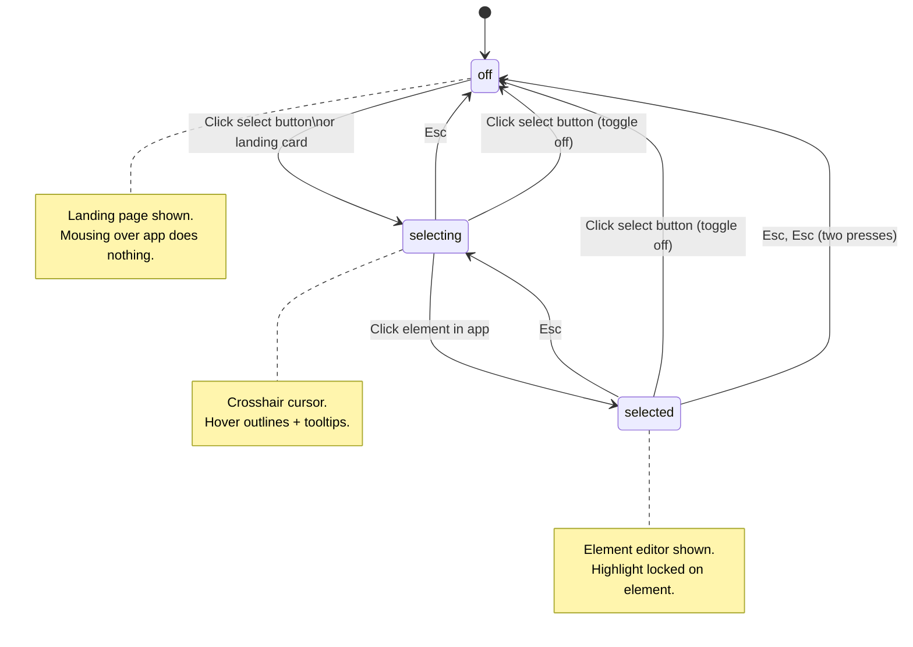

# Select Mode State Machine

## Overview

The Select button (in the ModeToggle toolbar and landing page) controls a three-state lifecycle for picking and editing elements. Today the button shows only two visual states (on/off), but the underlying behavior has three distinct states.

This spec defines those states, their transitions, and the Escape key ladder.

---

## States

| State | Description | Overlay cursor | Hover outlines | Element editor | Button color |
|-------|-------------|----------------|----------------|----------------|---------------|
| **off** | No mode active. Landing page shown. Mousing over the app does nothing. | default | no | no | gray |
| **selecting** | Crosshair active. Hovering over the app shows outlines and tooltips. Waiting for the user to click an element. | crosshair | yes | no | **orange** |
| **selected** | An element is locked in. The panel shows the Design/Replace tabs for editing. | default | locked highlight | yes | **teal** |

### Mapping to current code

| State | `mode` | `selectModeActive` | `elementData` |
|-------|--------|--------------------|---------------|
| **off** | `null` | `false` | `null` |
| **selecting** | `'select'` | `true` | `null` |
| **selected** | `'select'` | `false` | `{...}` |

---

## State Diagram



---

## Transitions

| # | From | Trigger | To | Panel action | Overlay action | WS messages |
|---|------|---------|-----|--------------|----------------|-------------|
| 1 | **off** | Click select button or landing card | **selecting** | `setMode('select')`, `setSelectModeActive(true)`, clear element | `setSelectMode(true)` — crosshair on, hover listeners on | Panel→Overlay: `MODE_CHANGED(select)` |
| 2 | **selecting** | Click element in app | **selected** | `setElementData(...)`, `setSelectModeActive(false)` | `setSelectMode(false)` — crosshair off, store element, show highlight | Overlay→Panel: `SELECT_MODE_CHANGED(false)`, `ELEMENT_SELECTED(...)` |
| 3 | **selecting** | Esc | **off** | `setMode(null)`, `setSelectModeActive(false)` | `setSelectMode(false)` — crosshair off | Panel→Overlay: `CANCEL_MODE` |
| 4 | **selecting** | Click select button (toggle) | **off** | `handleModeChange(null)` | `setSelectMode(false)` | Panel→Overlay: `CANCEL_MODE` |
| 5 | **selected** | Esc | **selecting** | `setElementData(null)`, `setSelectModeActive(true)` | Clear highlights, `setSelectMode(true)` — crosshair re-enabled | Panel→Overlay: `CLEAR_HIGHLIGHTS(deselect)`, `TOGGLE_SELECT_MODE(true)` |
| 6 | **selected** | Click select button (toggle) | **off** | `handleModeChange(null)` — clears everything | Clear highlights, `setSelectMode(false)` | Panel→Overlay: `CANCEL_MODE` |

---

## Escape Key Ladder

Pressing Escape repeatedly walks backwards through the states, one step at a time:

```
selected ──Esc──▶ selecting ──Esc──▶ off
```

- **From selected:** Deselects the element, re-enters crosshair picking mode.
- **From selecting:** Exits select mode entirely, returns to landing page.
- **From off:** No effect (already at landing).

---

## Button Visual State — Implemented

The `ModeToggle` component now accepts an `isPicking` prop and uses **3 visual states** for both the Select and Insert buttons:

| State | Button color | CSS class |
|---|---|---|
| **off** | Gray `#999` | `bg-transparent text-[#999]` |
| **picking** | Orange `bv-orange` `#F5532D` | `bg-[#F5532D]/15 text-[#F5532D]` |
| **engaged** | Teal `bv-teal` | `bg-[#00464A] text-[#5fd4da]` |

### Select button states

```
  ┌─────────┐         ┌─────────────┐         ┌─────────────┐
  │  ○ Gray │──click──▶│  ● Orange   │──pick───▶│  ● Teal     │
  │   off   │         │  selecting  │         │  selected   │
  └─────────┘◀──Esc───└─────────────┘◀──Esc───└─────────────┘
```

- **Orange** when `mode === 'select'` and `selectModeActive === true` (crosshair on, no element yet)
- **Teal** when `mode === 'select'` and element is selected (editing)

### Insert button states

```
  ┌─────────┐         ┌─────────────┐         ┌─────────────┐
  │  ○ Gray │──click──▶│  ● Orange   │──lock────▶│  ● Teal     │
  │   off   │         │  browsing   │         │  placing    │
  └─────────┘◀──Esc───└─────────────┘◀──Esc───└─────────────┘
```

- **Orange** when `mode === 'insert'` and no element data yet (drop zone active, waiting for placement)
- **Teal** when `mode === 'insert'` and an insert point is locked (component ready to place)

### Bug Report button

Always **teal** when active (no picking sub-state).

### Implementation

`ModeToggle` takes `isPicking: boolean`. Each caller in `App.tsx` computes it:

| Render context | `isPicking` value |
|---|---|
| Landing page (`mode === null`) | `false` |
| Bug report view | `false` |
| Mode active, no element | `selectModeActive \|\| (mode === 'insert' && !elementData)` |
| Element selected | `false` |

```tsx
// ModeToggle.tsx
const engagedStyle = 'bg-[#00464A] text-[#5fd4da] shadow-[0_1px_3px_rgba(0,0,0,0.3)]';
const pickingStyle = 'bg-[#F5532D]/15 text-[#F5532D] shadow-[0_1px_3px_rgba(0,0,0,0.3)]';

function buttonStyle(isActive: boolean, isPicking: boolean) {
  if (!isActive) return inactiveStyle;
  return isPicking ? pickingStyle : engagedStyle;
}
```

---

## Relationship to "Armed"

The codebase uses **"armed"** in the context of insert/draw mode — when a user has picked a component from the Storybook list and is hovering over the app to place it. The `COMPONENT_DISARMED` message fires when the placement completes or cancels.

For select mode, **"selecting" is the conceptual equivalent of "armed"** — the picker is loaded and waiting for the user to choose a target. The parallel:

| Concept | Select mode | Insert mode |
|---------|-------------|-------------|
| Ready to pick | **selecting** (crosshair, hover outlines) | **armed** (component loaded, drop zone active) |
| Target locked | **selected** (element editor visible) | *placed* (component inserted) |
| Idle | **off** (landing page) | **off** (landing page) |

---

## Design Questions

1. **Should clicking the select button while "selected" go to "selecting" instead of "off"?** Currently it jumps straight to off (landing page), unlike Escape which goes to selecting first. Making the button mirror the Escape ladder would be more consistent.

2. ~~**Should the button visually distinguish "selecting" from "selected"?**~~ **Yes — orange for selecting, teal for selected.** See "Proposed (3 visual states via color)" above.

3. **Should we unify the naming?** If "selecting" = "armed" for select mode, we could adopt armed/engaged vocabulary across both select and insert modes for consistency.
